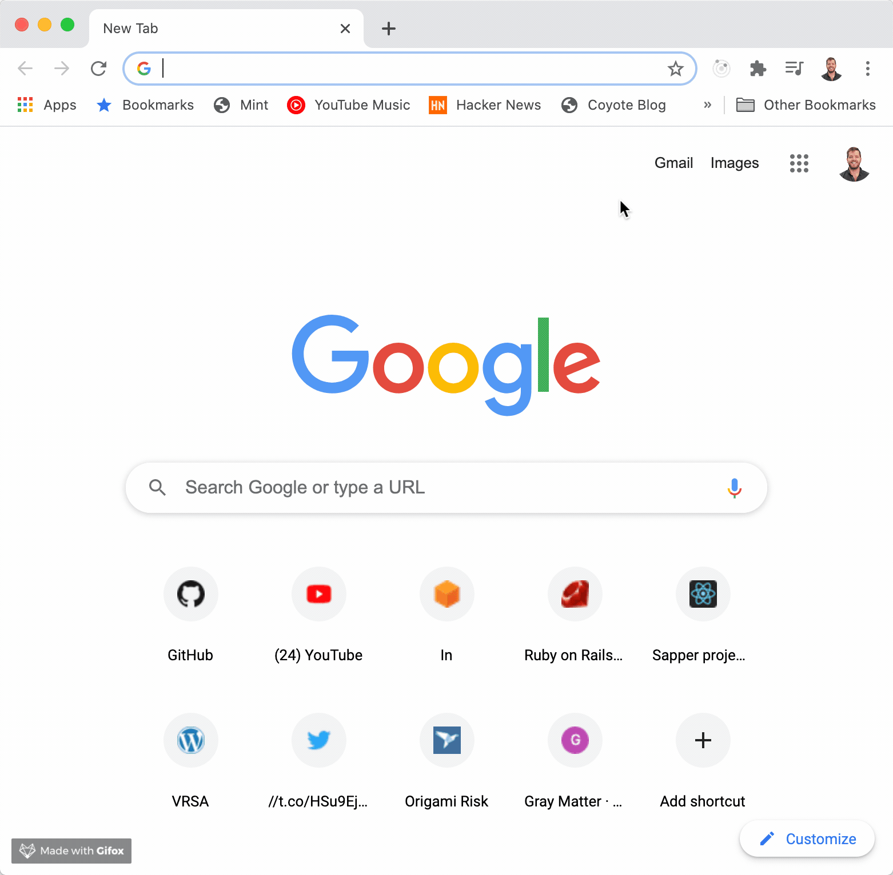

# Stonky 🤑

It's a bad name, but whatcha gonna do 🤷‍♂️

# Demo

## Try it yourself

[https://demyst-stonky.herokuapp.com/](https://demyst-stonky.herokuapp.com/)

# Getting started

1. `bundle install`
2. `yarn install`
3. `bundle exec rails db:create db:migrate`
4. `bundle exec rails server`
5. `bundle exec rails test ; bundle exec rails test:system`

# High level architecture

## Users

Standard rails here. Sign up form at `GET /users/new`. That `POSTs` to `/users` to create a new user.

Uses `has_secure_password`.

## Sessions

Mostly standard. Sign in form at `GET /sessions/new`. That `POSTs` to `/sessions` to sign in. Sign out button links to `DELETE /sessions` to destroy the session.

Hand-rolled setup using session cookie to store `:user_id`. Nothing non-standard, though. All that logic is in a concern -- `CookieAuthentication` -- that gets included in `ApplicationController`. Methods of note:

| method | description |
|-|-|
| `sign_in(user)` | saves `user.id` to `session[:user_id]` |
| `sign_out` | purges `session[:user_id]` and `@current_user` |
| `current_user` | returns `@current_user` or attempts to load it from the session cookie |
| `require_user` | used in `before_action` to require a user be signed in. records requested url (also in session) if it's `GET`, and redirects there after logging in. |

## StockChecks

The controller is mostly standard. There's a `GET /stock_checks/new` that just shows the form. This is aliased to `root_path`. It's also where you're redirected to after signin in.

StockChecks are accessed at `GET /stock_checks/:stock_symbol`, which uses `stock_checks#show`. This should feel like fairly standard rails. It uses a `Finnhub::Quote` model that quacks like a model (as far as our app is concerned anyway). The action does know that it's backed by an API call and rescues a `Finnhub::RequestError`.

Both pages display the form.

There's a Stimulus controller on the form -- `user_provided_link_to_controller` -- that grabs the user's input, turns that into the correct link, and navigates using Turbolinks.

## lib/finnhub

A loose wrapper around the Finnhub API. Our Rails app interacts with it through `Finnhub::Quote.find_by(stock_symbol: "GME")`, which returns an instance of `Finnhub::Quote` that has an `open_price` method.

## Tests

Normal controller tests. A single system test to verify stock searching works, and that the JavaScript sprinkled on our form works.

The `Finnhub` wrapper is tested in the `test/lib/finnhub` folder.

To test Finnhub API calls, there's an API mock of the Finnhub API. It's a barebones Sinatra app in `test/test_helpers/fakes/finnhub/api.rb`. We use `webmock` to block http traffic in tests. Tests that would call the API -- `test/lib/finnhub`, `StockChecksControllerTest`, and `StockChecksSystemTest` -- can instead create an instance of the fake API, and opt in to directing `finnhub.io` traffic to that.

## Frontend setup

Turbolinks for link clicks. Stimulus to handle turning the stock check form into a Turbolinks request to `/stock_checks/:stock_symbol`, swapping `:stock_symbol` for the user's input.

Tailwindcss for styling. There's a custom `TailwindFormBuilder` to handle styling the forms. `tailwind_form_with` is a wrapper around Rails's `form_with` that uses the custom form builder.
